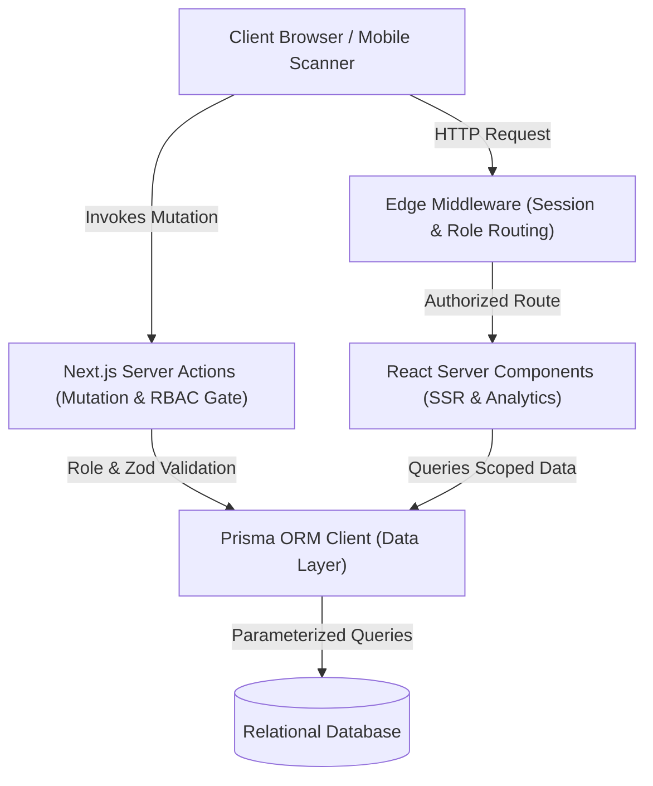
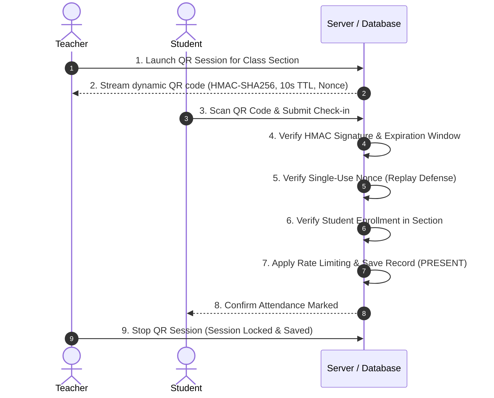

# Smart Attendance Management System

> 🌐 **Live Production App:** [https://attendence-puce.vercel.app](https://attendence-puce.vercel.app)  
> 📦 **GitHub Repository:** [https://github.com/SomnathShaw001/attendence](https://github.com/SomnathShaw001/attendence)

A state-of-the-art, role-based educational attendance platform built with **Next.js 16 (App Router)**, **React 19**, **Prisma ORM**, **Tailwind CSS**, and **NextAuth.js**. Designed for universities and colleges to eliminate attendance fraud through dynamic time-rotating QR roll calls, automated debarment risk detection, detailed audit trails, and multi-dimensional institutional reporting.

---

## Overview

The **Smart Attendance Management System** replaces cumbersome paper roll calls with a secure, real-time digital attendance suite. It provides institutional administrators, faculty members, and students with tailored dashboards that streamline daily attendance tracking, deliver predictive attendance analytics, enforce institutional 75% attendance thresholds, and prevent proxy attendance through cryptographic rotating QR codes.

---

## Features

- 🔐 **Role-Based Access Control (RBAC):** Dedicated permissions and scoped data access for Administrators, Teachers, and Students.
- 📱 **Anti-Proxy Dynamic QR Roll Call:** 
  - Teacher screen streams dynamically rotating QR codes (10s TTL).
  - Signed using HMAC-SHA256 with unique session secrets and single-use cryptographic nonces.
  - Zero-replay tolerance and rate-limited student check-in submissions.
- 📋 **Fast Manual Roll Call:** Rapid single or bulk attendance recording (`PRESENT`, `ABSENT`, `LATE`, `EXCUSED`) with custom notes.
- 📜 **Attendance History & Audit Logs:**
  - Multi-dimensional filtering by date range, class section, subject, student, and attendance status.
  - Full audit trail logging previous status, modifying teacher/admin, timestamp, and audit remarks.
  - Locked attendance sessions that prevent unauthorized modifications.
- 📊 **Real-Time Analytics & Risk Debarment Engine:**
  - Accurate attendance percentages and status distribution charts.
  - Daily longitudinal trends and subject-wise breakdowns.
  - Automated detection of students below the 75% attendance threshold with dynamic calculation of required recovery sessions.
- 📑 **Institutional Reporting & CSV Exports:**
  - Student, Class Section, and Subject attendance reports.
  - Date-range scoped analytics recalculations.
  - RFC 4180 CSV export with formula injection sanitization (CWE-1236).
- 🏫 **Comprehensive Academic Directory:** Full management of Academic Terms, Departments, Subjects, Class Sections, Faculty, and Students.

---

## Tech Stack

| Layer | Technology |
|---|---|
| **Framework** | Next.js 16.3.5 (App Router, Turbopack, Server Actions) |
| **Frontend** | React 19.2.8, Lucide React, Tailwind CSS |
| **Database & ORM** | SQLite (Dev) / PostgreSQL (Prod), Prisma ORM 5.22 |
| **Authentication** | NextAuth.js 4.24 (Credentials Provider with bcryptjs, JWT Sessions) |
| **Validation** | Zod 4.6 (Strict input validation & schema parsing) |
| **Cryptography** | Node.js `crypto` (HMAC-SHA256 dynamic token signing, SHA-256 nonces) |
| **Testing** | Custom automated integration suite (12 suites, 216 tests via `tsx`) |

---

## Architecture

The system follows a modern Next.js 16 modular architecture leveraging React Server Components (RSC) for data fetching, Server Actions for mutations, and Edge Middleware for route protection.



---

## User Roles

| Role | Access Scope | Key Capabilities |
|---|---|---|
| **ADMIN** | Institutional Global | • Create/manage classes, subjects, faculty, and students<br>• System threshold configuration<br>• View institutional reports and global audit logs<br>• Override locked attendance records |
| **TEACHER** | Assigned Sections | • Conduct manual roll calls for assigned classes<br>• Launch and stream live Dynamic QR Roll Calls<br>• View class attendance trends and debarment alerts<br>• Edit attendance records with audit logs |
| **STUDENT** | Personal Self-Scope | • View personal enrolled classes, schedule, and attendance rate<br>• Scan dynamic QR codes via `/attendance/qr/scan`<br>• Monitor personal 75% threshold & debarment alerts<br>• Export personal attendance summary |

---

## Attendance Workflow



---

## Database Design

The database schema is defined in [`prisma/schema.prisma`](file:///c:/Users/shaws/projects/attendence/prisma/schema.prisma) with full relational integrity and compound unique indexes to guarantee zero duplicates.

```mermaid
erDiagram
    User ||--o| TeacherProfile : "has"
    User ||--o| StudentProfile : "has"
    TeacherProfile ||--o{ Class : "teaches"
    Subject ||--o{ Class : "taught_in"
    Term ||--o{ Class : "scheduled_in"
    Class ||--o{ ClassEnrollment : "enrolls"
    StudentProfile ||--o{ ClassEnrollment : "enrolled_in"
    Class ||--o{ ClassSession : "holds"
    ClassSession ||--o{ AttendanceRecord : "records"
    StudentProfile ||--o{ AttendanceRecord : "receives"
    AttendanceRecord ||--o{ AttendanceAuditLog : "tracks"
    ClassSession ||--o{ AttendanceNonce : "validates"

    ClassSession {
        string id PK
        string classId FK
        datetime date
        string status
        boolean isQrActive
        string qrSecret
        datetime qrExpiresAt
    }

    AttendanceRecord {
        string id PK
        string sessionId FK
        string studentId FK
        string status
        string remarks
    }
```

---

## Security

The platform has undergone a rigorous 20-point pre-production security audit:

- **100% Parameterized Queries:** Zero raw SQL injection risk via Prisma query builders.
- **Anti-Replay QR Defense:** Every rotating QR code contains an HMAC-SHA256 signature, 10-second expiration, and a cryptographic nonce consumed on first scan.
- **In-Memory Rate Limiting:** Sliding-window rate limiter prevents scan brute-forcing and script spam.
- **Formula Injection Mitigation (CWE-1236):** CSV exports neutralize formula execution triggers (`=`, `+`, `-`, `@`, `\t`, `\r`) with single quotes.
- **Native SVG Vector Rendering:** QR codes render directly through native React JSX elements, eliminating `dangerouslySetInnerHTML`.
- **Production Backdoor Lockout:** Test authentication overrides (`TEST_AUTH_USER_ID`) are barred from production environments (`NODE_ENV !== "production"`).
- **IDOR Protection:** Strict server-side verification ensures students can never query or manipulate records of other students.

---

## Screenshots

| View | Description |
|---|---|
| **Dashboard** | Overview of institutional attendance rates, quick actions, schedule, and debarment warnings. |
| **Take Attendance** | Fast manual roll call interface with single and bulk status toggling. |
| **Live QR Roll Call** | Teacher modal streaming dynamic rotating QR codes with real-time scan counters. |
| **QR Scanner** | Student camera scanner interface supporting automated decode and manual payload input. |
| **Attendance History** | Multi-filter historical attendance ledger with audit trail inspection modal. |
| **Analytics & Reports** | Institutional reports with threshold detection and CSV export capability. |

---

## Installation

### Prerequisites
- **Node.js**: `v18.18.0` or higher (Node.js 20+ recommended)
- **npm** or **yarn** or **pnpm**

### Step-by-Step Setup

1. **Clone the repository:**
   ```bash
   git clone https://github.com/SomnathShaw001/attendence.git
   cd attendence
   ```

2. **Install dependencies:**
   ```bash
   npm install
   ```

3. **Configure Environment Variables:**
   ```bash
   cp .env.example .env
   ```

4. **Initialize the Database:**
   ```bash
   npx prisma db push
   npx prisma db seed
   ```

---

## Environment Variables

Create a `.env` file in the root directory:

```env
# Database Connection URL (SQLite default, PostgreSQL for production)
DATABASE_URL="file:./dev.db"

# NextAuth Configuration
NEXTAUTH_URL="http://localhost:3000"
NEXTAUTH_SECRET="super-secret-random-key-at-least-32-chars"

# Optional: Google OAuth Provider (leave empty to disable)
GOOGLE_CLIENT_ID=""
GOOGLE_CLIENT_SECRET=""

# Institutional Attendance Threshold (Default 75%)
ATTENDANCE_THRESHOLD=75
```

---

## Development

Start the local development server:

```bash
npm run dev
```

Open [http://localhost:3000](http://localhost:3000) in your browser.

### Default Seeded Test Accounts

| Role | Email | Password |
|---|---|---|
| **Admin** | `admin@university.edu` | `Admin@123` |
| **Teacher** | `teacher@university.edu` | `Teacher@123` |
| **Student** | `student@university.edu` | `Student@123` |

---

## Testing

The project includes an automated test suite containing 12 test suites and 216 tests covering Authentication, Dashboard, Students, Teachers, Classes, Attendance, History, Analytics, Reporting, QR Attendance, and Security Hardening.

```bash
# Run linting
npm run lint

# Run type check
npx tsc --noEmit

# Run all 12 test suites (216 tests)
npm test
```

---

## Deployment

### Vercel Deployment

1. **Push your code to GitHub:**
   ```bash
   git push origin main
   ```
2. **Import project into Vercel:**
   - Go to [vercel.com](https://vercel.com) and import the `SomnathShaw001/attendence` repository.
3. **Configure Environment Variables in Vercel:**
   - Set `DATABASE_URL` (use a hosted PostgreSQL instance like Supabase, Neon, or Railway).
   - Set `NEXTAUTH_SECRET` (generate a random 32+ character string).
   - Set `NEXTAUTH_URL` (your production URL, e.g. `https://your-app.vercel.app`).
4. **Deploy:**
   - In your build command or package.json postinstall, ensure Prisma generates the client:
     ```bash
     npx prisma generate
     ```

---

## Future Improvements

- 📍 **GPS Geofencing:** Optional classroom coordinate matching to prevent live screen-sharing proxy attendance.
- 📡 **Bluetooth Low Energy (BLE) Beacons:** Proximity check-in for lecture halls.
- 📷 **Facial Verification:** Optional secondary facial match on check-in.
- 🔔 **Push Notifications & SMS Alerts:** Automated WhatsApp/SMS alerts sent to students and parents when attendance dips below 75%.
- 📲 **Native Mobile App:** React Native / Flutter client with camera hardware integration.
